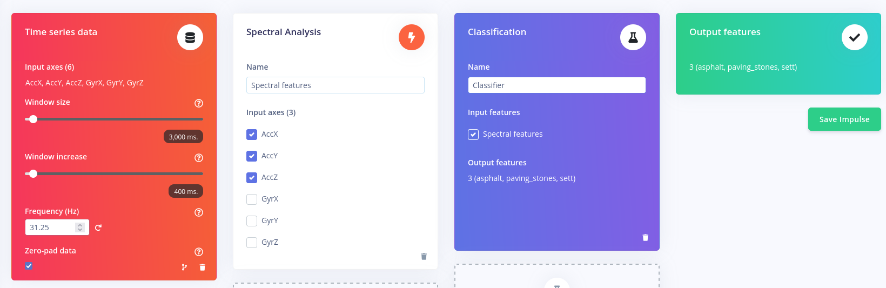

### training/
I tried to replicate the edge impulse model that uses flattened input. 
Use the file `edge_impulse_to_tf_pkl.py` to convert data recorded with edge impulse to pkl files for training, testing and validation. If you record new data just export it and unpack it in the `trainingsdata` folder.

Use the file `train_dense.py` to train a model with dense layers with the previously generated data. You can see the model structure in `model_dense.png`. You can see how well the training went in `models/training_validation_plot.png`. 
To turn the resulting trained tflite model into an array of bytes for running it on a microcontroller use the following command:

`xxd -i models/model_dense.tflite > models/model_dense.cc`

### deployment_sensebox/mini_detector/
Insert the byte array, that was generated in the previous step, in the `mpu_handler.ino`. If you change the recording frequency and window size of the trainingsdata, you also need to change it here. Currently its set at 31.25 Hz with a window size of 3 seconds.

### deployment_sensebox/edge_impulse_export/
It is also possible to export an edge impulse project as an arduino library. Ive done that for the following impulse design:

I then adjusted the "nano_ble_33sense_acceleration" example, which comes with the library. If the impulse design is further adjusted, the arduino code might also have to be changed.
